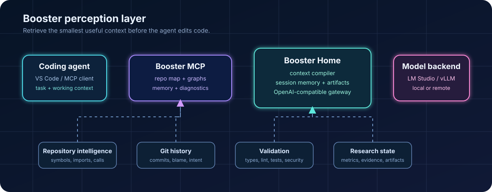
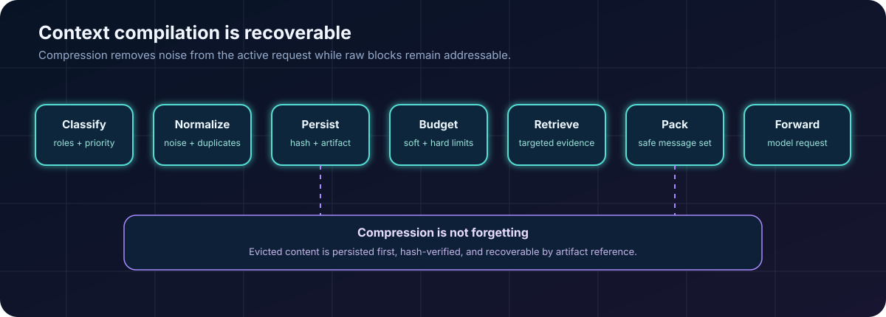

# Booster MCP

<p align="center">
  <strong>A cognitive runtime for AI coding agents</strong><br>
  <sub>Repository intelligence, project memory, impact analysis, diagnostics, validation, and context compression.</sub>
</p>

<p align="center">
  <a href="https://github.com/NeuroGhostDev/Booster-mcp/actions/workflows/test.yml"></a>
  <a href="https://www.python.org/"></a>
  <a href="LICENSE"></a>
</p>

**Documentation:** [English](README.md) | [Русский](README.ru.md) | [简体中文](README.zh-CN.md)

<p align="center">
  
</p>

Booster is a local [Model Context Protocol (MCP)](https://modelcontextprotocol.io/)
server and cognitive runtime for AI coding agents. It builds a bounded, queryable
world model of a repository so an agent can inspect architecture, history,
diagnostics, project rules, and validation requirements before changing code.

Most agents already have hands: they can write patches quickly. Booster gives
them the perception layer that is usually missing.

## Why Booster Exists

Large repositories do not primarily overwhelm agents because they contain many
files. They overwhelm agents because the important relationships are scattered
across source code, tests, git history, diagnostics, and project conventions.

Without Booster, an agent often follows this loop:

```text
request -> grep/search -> read a few files -> write a patch -> stop
```

That loop can miss:

- callers and callees of the target symbol;
- the files and tests affected by an interface change;
- the historical reason behind surprising code;
- project-specific rules and stored architectural decisions;
- existing compiler, type, lint, or security diagnostics;
- the validation command that should run after the patch.

Booster adds those signals to the loop:

```text
request
  -> project memory
  -> repository map and hybrid search
  -> AST impact graph
  -> git history and blame
  -> diagnostics and security checks
  -> validation plan
  -> focused patch
  -> validation and repair
```

<p align="center">
  
</p>

## Capabilities

| Agent problem | Booster capability | Outcome |
| --- | --- | --- |
| Blind search through a large repository | Bounded scanning, Repo Map, and hybrid semantic plus lexical retrieval | Faster orientation with less context waste |
| File snippets without architecture | Tree-sitter symbols, import and call graphs, and impact analysis | Blast radius is visible before editing |
| No memory between sessions | Structured project memory in `.agents/booster/memory.json` | Rules and decisions survive restarts |
| Unclear historical intent | Git log and blame through `git_intelligence` | Debugging includes historical context |
| Diagnostics ignored by the agent | Fail-closed compiler, linter, type, and security diagnostics | Broken checks are not reported as success |
| Patch generation without an engineering loop | `validation_loop_plan` and `run_validation_checks` | Plan -> implement -> validate -> repair |
| Reindexing generated files and dependencies | Shared scanner and watcher ignore rules | Caches and dependency folders stay out of the model |

## Architecture

Booster has two complementary planes:

- **MCP control plane**: repository indexing, semantic search, graphs, memory,
  diagnostics, skills, and validation tools.
- **Booster Home data plane**: an optional local OpenAI-compatible gateway that
  compiles context, stores recoverable artifacts, and forwards requests to a
  local or remote model backend.

The existing repository index and Cognitive Runtime are reused. Home does not
create a second repository index, gateway, or vector database.

### MCP Control Plane

The core server provides:

- normalized FAISS cosine search, BM25 lexical search, and reciprocal-rank
  fusion through `hybrid_search`;
- bounded repository scanning with reproducible scan profiles;
- generated `.agents/booster/` artifacts such as
  `repo_map_architecture.md`, `repo_map_symbols.md`, `index_health.json`,
  `repo_map.md`, `code_city.html`, `scan_config.json`, and `scan_report.json`;
- context resources at `repo://map`, `repo://stack`, `repo://conventions`, and
  `repo://artifacts`;
- symbols, import and call graphs, flipcharts, Code City, and repository
  diagnostics;
- impact analysis, git intelligence, structured project memory, security
  checks, and validation loops;
- twelve bundled workflow skills synced to `~/.agents/skills`;
- `booster control`, a cross-platform control surface for MCP clients, scan
  settings, diagnostics, and launcher management.

### Booster Home Runtime

Home is an optional local data plane. It keeps the MCP control plane intact and
adds an OpenAI-compatible gateway with deterministic context compilation,
bounded local workers, session-scoped raw artifacts, and targeted integration
with the existing Booster index and Cognitive Runtime.

<p align="center">
  
</p>

Start it on loopback:

```bash
booster home \
  --base-url http://127.0.0.1:1234/v1 \
  --model nvidia/nemotron-3-nano-4b \
  --api-key lm-studio \
  --project .
```

Home exposes:

- `/v1/models`;
- `/v1/chat/completions`;
- `/v1/responses`;
- `/health`;
- `/booster/status`.

The upstream model ID is discovered from `/v1/models`; replace it with the ID
reported by the local OpenAI-compatible server. Nemotron deployments may return
provider-specific `reasoning_content` instead of `message.content` when the
output budget is consumed by reasoning. Home preserves that field and does not
silently convert an incomplete reasoning response into a successful answer.

Streaming responses are forwarded as chunks. Before a block is evicted, its raw
content is saved as an immutable artifact and verified by content hash. If
persistence fails, the request fails closed instead of silently losing context.

Repository indexing is job-based. `add_repo(wait=true)` remains accepted for
compatibility but no longer blocks the MCP request. Use `index_status`,
`cancel_index`, and bounded `wait_until_ready` to observe a job. Each status
contains `job_id`, phase, processed/total, elapsed time, ETA, last progress,
generation ID, stale state, and the last ready snapshot. Read-only repository
methods continue returning that ready snapshot while a new generation is being
built.

The generated artifacts are split by purpose:

- `repo_map_architecture.md` is a bounded macro map with top-level module
  diversity, entrypoint/config/contract coverage, and a coverage summary;
- `repo_map_symbols.md` contains the detailed symbol map with a per-file cap;
- `index_health.json` records generation, stale paths, selected/skipped files,
  and map completeness;
- `repo_map.md` remains a compatibility copy of the architecture map.

Configuration precedence is:

```text
defaults
  -> ~/.booster/home.toml
  -> <project>/.agents/booster/home.toml
  -> explicit --config
  -> CLI flags
```

API keys are used only in upstream request headers and are redacted from status,
telemetry, timelines, logs, and exception text. These commands inspect Home
without starting a second server or repository index:

```bash
booster home status
booster home doctor --json
booster home inspect-context --input request.json --json
booster home sessions delete <session-id>
```

Loopback is the default and does not require a gateway token. A non-loopback
bind is rejected unless `home.auth_token` is configured, either in TOML,
through `BOOSTER_HOME_AUTH_TOKEN`, or with `--auth-token`. Remote requests must
send `Authorization: Bearer <token>`; the token is never returned by status or
logs.

## Proof: Booster + Nemotron 4B

The strongest way to understand Booster is to see the loop on a hard problem.
In a manual LM Studio run with the same 4B-class Nemotron model, a plausible
first solution failed hidden cases. After Booster context, explicit constraints,
and a repair-and-submit loop, the same workflow produced accepted submissions:

| Without the loop | With Booster context and verification |
| --- | --- |
|  |  |
| Hidden edge cases expose a plausible but incomplete recurrence. | Full judge validation: `354/354` accepted. |

The pattern repeated on additional hard dynamic-programming tasks:

- `689. Maximum Sum of 3 Non-Overlapping Subarrays`: tie-breaking failure ->
  `43/43` accepted;
- `123. Best Time to Buy and Sell Stock III`: `214/214` accepted;
- the recorded accepted runs show `36 ms` and `170 ms` local runtimes.

This is an evidence case study, not a controlled benchmark. It demonstrates the
customer-facing value: Booster keeps constraints, project context, diagnostics,
and validation in one loop instead of stopping at code that merely looks right.

See the [full LeetCode case study](algocheck/Booster%20LeetCode%20check.md) for
the baseline, repair steps, screenshots, and reproduction checklist.

## Context Compression

Home treats compression as context compilation, not irreversible forgetting:

1. Classify messages by role and content type.
2. Normalize deterministic noise such as duplicate lines, progress output, and
   ANSI escape sequences.
3. Persist the original block before it can be evicted.
4. Score relevance and allocate the available input budget by priority.
5. Optionally run bounded semantic workers and targeted world-model retrieval.
6. Pack the selected messages while preserving protected context and tool-call
   integrity.

The compiler reports `original_tokens`, `compiled_tokens`, `removed_tokens`,
`compression_ratio`, operations, warnings, and artifact references. The main
invariants are:

- system and active user context are protected;
- known hard limits fail closed when protected context cannot fit;
- raw data is persisted before eviction;
- artifact content is hash-verified after writing and reading;
- compression can be disabled, but `policy=off` still refuses a request above
  a known hard input budget;
- provider-specific fields, including `reasoning_content`, are preserved.

Run the included stress benchmark:

```bash
uv run python benchmarks/home_context_benchmark.py
```

The benchmark prints raw, deterministic, retrieved, and final token counts,
compression ratio, compiler latency, exact artifact recovery, and targeted
enrichment results. A successful run must include:

```text
exact_artifact_recovery=True
```

## Research Coprocessor

Home also includes a bounded research coprocessor for local experiments. It
reads evidence from `research_state.json`, `memory_bank.md` or
`memory-bank/*.md`, metrics, and report files. It returns structured JSON rather
than presenting an opaque model-generated summary as ground truth.

| Tool | Purpose |
| --- | --- |
| `booster.project_snapshot` | Bounded project state; checkpoint files such as `.pt`, `.pth`, `.ckpt`, `.safetensors`, and `.bin` are metadata-only. |
| `booster.experiment_state` | Baseline, best result, active and failed hypotheses, confounds, assumptions, history, and metrics. |
| `booster.artifact_lookup` | Bounded lexical lookup by artifact meaning, name, and content. |
| `booster.log_digest` | Numeric JSON or JSONL digest with trend, anomalies, invalid rows, and possible confounds. |
| `booster.compare_runs` | Regime-aware run comparison; mismatches return `NOT DIRECTLY COMPARABLE` without numeric deltas. |
| `booster.hypothesis_register` | Scientific memory with IDs such as `H-001`, evidence, status, confounds, and confidence. |
| `booster.next_experiment` | Candidate experiment design derived from a registered hypothesis. |
| `booster.context_pack` | Layered `L0`-`L4` context for `coding`, `debug`, `research`, `review`, or `benchmark` mode. |
| `booster.worker_delegate` | Bounded delegation to a fixed research worker role. |
| `booster.checkpoint_registry` | Checkpoint metadata plus `KEEP` and `DELETE_CANDIDATES`; files are never deleted automatically. |
| `booster.lightning_trace` | Visualization of an existing LightningField trace; missing traces are not fabricated. |

Binary checkpoint bodies are never read, indexed, or sent to the model. Only
metadata such as filename, size, step, parent, metrics, experiment, status,
keep flag, and branch is available. Sidecar metadata is searched next to the
checkpoint using `.pt.json`, `.json`, `_metadata.json`, and `.metadata.json`
conventions.

The context pack is organized as:

```text
L0  current task
L1  current experiment and active hypotheses
L2  recent evidence and relevant code
L3  project invariants and runtime contract
L4  archive
```

Normal inference uses `L0`, `L1`, and relevant parts of `L2` and `L3`.
Duplicate logs, old failed versions, binary artifacts, and irrelevant history
are excluded by policy. Repository content, metrics, reports, and memory are
untrusted data and are not executed as configuration.

Allowed worker roles are:

```text
log_analyst
code_search
benchmark_reader
artifact_indexer
summarizer
```

The research state and registry are written atomically to
`<project>/research_state.json`. Home session artifacts remain separate in
`.agents/booster/runtime/sessions/`; research state is not mixed with chat
timelines or the legacy `.agents/booster/memory.json`.

## Repository Layout

```text
.
├── booster_home/              # Optional OpenAI-compatible data plane
├── assets/                    # README and Code City visual assets
├── algocheck/                 # Customer-facing LeetCode validation evidence
├── benchmarks/                # Reproducible context and runtime benchmarks
├── docs/                      # Architecture and maintainer documentation
├── skills/                    # Bundled agent workflow skills
├── tests/                     # Pytest suite, including Home regressions
├── server.py                 # MCP server entrypoint
├── cli.py                    # `booster` CLI entrypoint
├── cognitive_runtime.py      # Impact, memory, diagnostics, and validation tools
├── indexer.py                # Repository indexing and graph construction
├── visualizer.py             # Code City generation
├── AGENTS.md                 # Agent-first bootstrap and project instructions
├── RECOMENDET_PROMPT.md      # Repository-wide engineering prompt for agents
├── CONTRIBUTING.md           # Development and contribution workflow
├── CHANGELOG.md              # Release history
├── pyproject.toml            # Package metadata and tool configuration
├── MANIFEST.in               # Source distribution contents
└── uv.lock                   # Reproducible dependency lockfile
```

The legacy MCP control-plane modules intentionally remain at the repository
root. The package entrypoints (`server:main` and `cli:main`) and existing
integrations rely on those stable module names. Moving them into `src/` should
be treated as a separate compatibility migration, not mixed into routine
feature work.

## Recommended Agent Prompt

This repository includes a dedicated engineering system prompt:
[`RECOMENDET_PROMPT.md`](RECOMENDET_PROMPT.md).

Load it at the beginning of a non-trivial coding session when the agent needs
to work as an engineer rather than as a patch generator. The prompt defines the
project-context routing rules, the `PERCEIVE -> MODEL -> PLAN -> ACT -> VERIFY
-> LEARN` workflow, Booster-first context retrieval, root-cause analysis,
security checks, validation requirements, and memory discipline.

It is repository guidance for coding agents, not application runtime
configuration. The prompt is intentionally kept at the root so agent tooling
can discover it before the first edit.

## Installation

### Requirements

- Python 3.11, 3.12, or 3.13. Python 3.12 is recommended.
- Git.
- Internet access on the first run to download the embedding model.

### Windows

```powershell
Invoke-WebRequest https://raw.githubusercontent.com/NeuroGhostDev/Booster-mcp/main/install.ps1 -OutFile install.ps1
.\install.ps1
```

### macOS and Linux

```bash
curl -fsSL https://raw.githubusercontent.com/NeuroGhostDev/Booster-mcp/main/install.sh | bash
```

Each installer creates a `booster` launcher in the user-local bin directory:

- Windows: `%USERPROFILE%\.local\bin\booster.cmd`;
- macOS and Linux: `~/.local/bin/booster`.

The installer adds that directory to `PATH`. Open a new terminal if the current
shell does not see the launcher yet.

### Development Installation

```bash
git clone https://github.com/NeuroGhostDev/Booster-mcp.git
cd Booster-mcp
uv sync --locked --extra dev
```

Without `uv`, use a Python 3.12 virtual environment:

```bash
python3.12 -m venv .venv
source .venv/bin/activate
python -m pip install --upgrade pip
python -m pip install .
```

On Windows, activate with `\.venv\Scripts\Activate.ps1` and use
`\.venv\Scripts\booster.exe` until the launcher is installed.

## Agent Bootstrap: Paste a GitHub Link, Get the Workflow

When this repository is opened from a GitHub URL in an AI coding agent, the
agent should treat [`AGENTS.md`](AGENTS.md) as the project bootstrap contract.
It should install the local dependencies, synchronize Booster skills, load the
engineering guidance, create the bounded repository artifacts, and connect the
MCP server before editing code.

Run this once from the repository root:

```bash
# 1. Install the project and its development dependencies.
uv sync --locked --extra dev

# 2. Install or update the bundled Booster skills for the current agent.
uv run python -c "from skill_installer import install_bundled_skills; print(install_bundled_skills())"

# 3. Load the repository into the bounded Booster world model.
uv run booster expand --profile balanced .

# 4. Connect the current repository to VS Code MCP.
uv run booster control connect \
  --client vscode \
  --scope workspace \
  --project . \
  --with-repository \
  --force

# 5. Verify the environment and generated artifacts.
uv run booster control doctor --project .
uv run booster control status --client vscode --scope workspace --project .
```

For Claude Desktop, use the user-level connection instead:

```bash
uv run booster control connect \
  --client claude \
  --scope user \
  --project . \
  --with-repository \
  --force
```

If `uv` is unavailable, use `python -m pip install -e ".[dev]"` and replace
`uv run booster` with `python -m cli` or the installed `booster` launcher.

The agent should then start every non-trivial task with:

```text
Read AGENTS.md and RECOMENDET_PROMPT.md.
Call inject_context(include_map=true, include_stack=true, include_conventions=true).
Use preflight_analysis and impact_analysis before editing code.
Use run_validation_checks after the patch.
Call booster.task_complete(task_id="<task-id>") before the final response.
```

This is intentionally project-level and portable. A repository must not silently
rewrite a host application's hidden system prompt or unrelated global client
configuration. `AGENTS.md` is the instruction file that agent hosts can discover;
`booster control connect` changes only the selected MCP client entry and preserves
other servers.

## Connect to VS Code

Run the control menu from the repository you want to manage:

```text
booster control
```

Use a workspace connection for one repository:

```text
cd path/to/project
booster control connect --client vscode --scope workspace --project .
booster expand --profile balanced
```

Use a user connection when Booster should appear in every VS Code workspace:

```text
booster control connect --client vscode --scope user --project .
```

After a user-level server starts, ask the agent to call `add_repo` for the
repository currently being edited. Indexing runs in the background by default;
`index_status` reports phase and progress. `add_repo(wait=true)` remains
accepted for compatibility but is also non-blocking. Use `cancel_index` or
bounded `wait_until_ready` when needed. Use `--with-repository` to bind a
user-level server to one repo.

VS Code keeps workspace and user MCP configuration separately. After changing a
server, run `MCP: List Servers`, select Booster, start or restart it, and accept
the trust prompt. If it is still missing, run `Developer: Reload Window` and
inspect `MCP: List Servers -> Booster -> Show Output`.

## Booster Control

`booster control` provides interactive connection management, scan profiles,
artifact refresh, diagnostics, server removal, and launcher updates. The same
operations are available non-interactively:

```text
# Show the active runtime, client entry, scan policy, and artifacts.
booster control status --client vscode --scope workspace --project .

# Add or remove a client entry.
booster control connect --client vscode --scope workspace --project .
booster control disconnect --client vscode --scope workspace --project .

# Connect another desktop client in the user profile.
booster control connect --client claude --scope user --project .

# Inspect and persist the bounded scan policy.
booster control scan --project .
booster control scan --project . --profile deep --max-files 2000

# Verify Python, FastMCP, FAISS, BM25, and embedding dependencies.
booster control doctor --project .
```

## Bounded Repository Scanning

Run `booster expand` before attaching a large repository. It saves the scan
policy and generates an initial map without requiring a live MCP connection.

```text
booster expand --profile balanced
```

| Profile | Depth | Source files | Selected source size | Best for |
| --- | ---: | ---: | ---: | --- |
| `quick` | 6 | 250 | 8 MiB | Fast initial orientation |
| `balanced` | 12 | 800 | 32 MiB | Most repositories |
| `deep` | 20 | 3,000 | 128 MiB | Large monorepos |

The scanner prioritizes conventional source roots, ignores generated and
dependency directories by default, and records every limit decision in
`.agents/booster/scan_report.json`. Add local exclusions in `.boosterignore`
when a directory is irrelevant to the current task.

## Cognitive Runtime Workflow

Use this flow when an agent is about to change code:

1. Recall project rules with `project_memory_recall`.
2. Find the target with `hybrid_search`, `semantic_search`, or `find_symbol`.
3. Estimate the blast radius with `impact_analysis`.
4. Check history with `git_intelligence` when code looks surprising.
5. Collect diagnostics with `collect_diagnostics` for files in scope.
   For security-sensitive changes, run the separate advisory `security_audit`.
6. Patch narrowly using the project's existing patterns.
7. Validate with `run_validation_checks` and repair the same slice until it
   passes or the hypothesis is rejected.

Typical preflight:

```text
project_memory_recall(query="refactor billing invoice flow", repo="<repo>")
impact_analysis(target="InvoiceService", repo="<repo>", max_depth=3)
git_intelligence(symbol="InvoiceService", repo="<repo>", limit=8)
collect_diagnostics(paths=["src/billing/invoice.py"], repo="<repo>")
```

Typical post-patch validation:

```text
run_validation_checks(
  paths=["src/billing/invoice.py"],
  commands=["pytest tests/billing -q"],
  repo="<repo>"
)
```

### Diagnostics Are Fail-Closed

Booster treats diagnostics as engineering evidence. A diagnostic tool that
times out, crashes, or returns unparseable output is reported as an `error`
finding. This prevents an agent from mistaking a broken validation run for a
clean codebase.

| Area | Checks |
| --- | --- |
| Python | In-process syntax compile, Ruff, and Pyright when installed |
| TypeScript and JavaScript | `tsc --noEmit` when `tsconfig.json` and `tsc` exist |
| Rust | `cargo check --message-format=json` when `Cargo.toml` exists |
| Security | `security_audit` runs Bandit and Semgrep when installed |
| Tests | Any focused command passed to `run_validation_checks` |

## Examples

### Before a Refactor

```text
impact_analysis(target="AuthService", repo="<repo>", max_depth=4)
git_intelligence(symbol="AuthService", repo="<repo>")
collect_diagnostics(paths=["src/auth/service.py"], repo="<repo>")
```

The agent can answer what calls the service, what it calls, which files are
affected, which tests are relevant, and whether red diagnostics already exist.

### During a Bug Hunt

```text
analyze_error("<stacktrace>")
git_intelligence(path="src/payments/locks.py", symbol="payment_lock")
flipchart_call_graph(symbol="payment_lock", max_depth=4)
```

The agent can combine the stack trace, call graph, and historical reason behind
a suspicious line.

### For Long-Term Project Knowledge

```text
remember_project_fact(
  category="architecture",
  fact="Frontend talks to backend only through the BFF layer",
  confidence=0.95,
  source="repo_map+impact_analysis"
)
```

Future sessions can recall that fact before editing the API or frontend.

## Bundled Workflow Skills

- `booster-architecture-map`
- `booster-bug-hunt`
- `booster-context-inject`
- `booster-cognitive-runtime`
- `booster-deep-dive`
- `booster-feature-add`
- `booster-flipchart`
- `booster-mcp-workflow`
- `booster-onboard`
- `booster-project-memory`
- `booster-refactor`
- `booster-review`

## Key MCP Tools

| Area | Examples |
| --- | --- |
| Repository lifecycle | `add_repo`, `remove_repo`, `reindex_repo`, `index_status`, `cancel_index`, `wait_until_ready`, `booster.task_complete`, `list_repos`, `repo_stats` |
| Search and navigation | `semantic_search`, `hybrid_search`, `find_symbol` |
| Context and artifacts | `inject_context`, `get_repo_artifacts`, `get_repo_map`, `get_code_city` |
| Reasoning and debugging | `flipchart_quick_debug`, `flipchart_call_graph`, `flipchart_sequence_diagram` |
| Cognitive Runtime | `preflight_analysis`, `impact_analysis`, `git_intelligence`, `remember_project_fact`, `project_memory_recall`, `collect_diagnostics`, `security_audit`, `validation_loop_plan`, `run_validation_checks` |
| Workflow support | `list_agent_skills`, `install_agent_skills`, `fetch_stack_docs` |

Repository bindings are persisted in the shared user registry at
`~/.booster/repositories/`, so independently spawned MCP processes see the
same active projects. `booster.task_complete` queues a final bounded reindex
for the task's repositories. Each completed index preserves
`.agents/booster/repo_map.md`, `code_city.html`, `scan_config.json`, and
`scan_report.json` in an immutable
`.agents/booster/snapshots/<commit>-<state>-<digest>/` directory. Previous
snapshots are never deleted; `.agents/booster/latest.json` points to the newest
one. Each snapshot also preserves `repo_map_architecture.md`,
`repo_map_symbols.md`, and `index_health.json`. The architecture map reserves
space for top-level module diversity and entrypoint/config/contract coverage;
the symbol map applies a per-file cap so large files cannot consume the whole
context budget.

## Troubleshooting

### Booster Is Missing from VS Code

Check both configuration scopes:

```text
booster control status --client vscode --scope workspace --project .
booster control status --client vscode --scope user --project .
```

Only a workspace entry is visible in that workspace. A user entry is visible in
all workspaces. Use `MCP: List Servers` to start, trust, restart, or inspect the
server. Use `MCP: Open User Configuration` to open the exact global file VS Code
is reading.

### `No module named rank_bm25`

The client is starting a different system Python instead of Booster's
environment. Repair the environment and reconnect through Booster Control:

```text
uv sync --locked --extra dev
booster control doctor --project .
booster control connect --client vscode --scope user --project . --force
```

### The Scan Is Too Narrow

Inspect the report, then select a broader profile or explicit limits:

```text
booster control scan --project . --profile deep
booster expand --profile deep
```

## Release Validation

```bash
uv lock --check
uv run python -m pytest tests -q
uv run ruff check .
uv run python -m compileall -q booster_home indexing_jobs.py server.py
uv build
```

For detailed workflows, see [COOKBOOK.md](COOKBOOK.md). For publishing and
client distribution, see [MARKETPLACE.md](MARKETPLACE.md). Maintainers should
also read [CONTRIBUTING.md](CONTRIBUTING.md) and
[CHANGELOG.md](CHANGELOG.md).

## Roadmap

Booster already maintains an in-memory Tree-sitter symbol, call, and import
graph. Planned production improvements include:

- persisting the knowledge graph to Neo4j or Memgraph for cross-session graph
  queries and deeper dependency traversal;
- adding headless LSP clients for Pyright, TypeScript, rust-analyzer, gopls,
  clangd, and Java language servers;
- linking commits to pull requests and issues so `git_intelligence` can explain
  why code changed, not only what changed;
- adding validation recipes for Docker Compose, health checks, and service logs;
- expanding bundled skills into agent-specific architecture, debugging,
  memory, and quality packs.

## License

MIT
